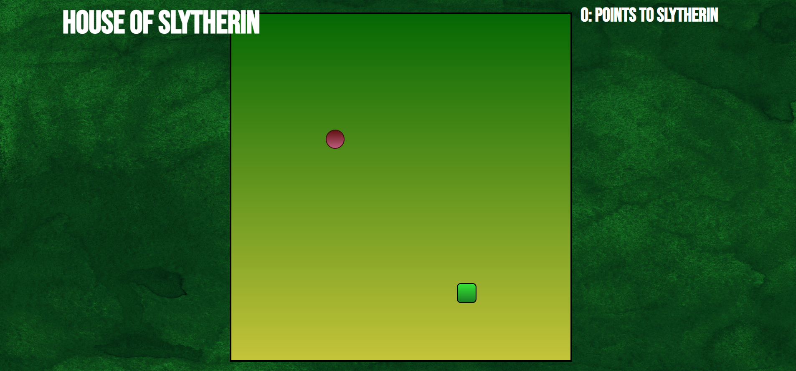

# Snake Game

This Snake Game is a classic implementation using HTML, CSS, and JavaScript. It brings back the nostalgic joy of playing the iconic Snake game that many of us grew up with on our mobile phones.

## How to Play

- **Objective:** Control the snake to eat the food and grow as long as possible without colliding with the walls or yourself.

- **Controls:**
  - Use the arrow keys (Up, Down, Left, Right) to navigate the snake.
  - The snake will automatically move in the direction you choose.

- **Scoring:**
  - Each time the snake eats food, its length increases, and your score goes up.
  - The game gets progressively challenging as the snake grows longer.

## Features

- **Responsive Design:**
  - The game adapts to different screen sizes, allowing you to play on both desktop and mobile devices.

- **Score Tracking:**
  - Keep track of your current score as you aim for a new high score.

- **Game Over:**
  - The game ends if the snake collides with the walls or itself. You can restart the game to try and beat your previous score.

## Try it Yourself

Play the Snake Game and challenge yourself to achieve the highest score! Simply open the HTML file in your web browser and start controlling the snake using the arrow keys.

Enjoy the nostalgia and have fun!

